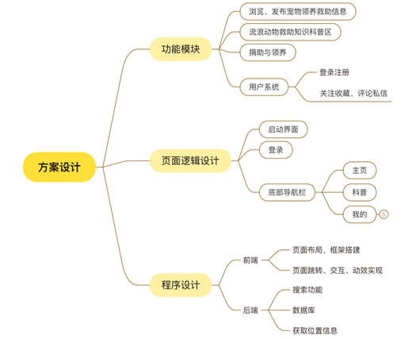

# 流浪动物 (StrayAnimals) 🐾

[English](README.md)

<p align="center">
  
</p>

一款致力于流浪动物救助、领养与宠物科普的 Android 应用程序。本项目旨在为流浪动物寻找温暖的家，并为爱宠人士提供一个交流互助的平台。

## 📖 项目介绍

“流浪动物” APP 针对当下流浪动物现状，提供了一个集信息发布、领养交流、知识科普为一体的移动平台。用户可以发布身边的流浪动物信息，帮助它们寻找领养人，同时也可以在平台上学习科学的养宠知识。

## 📱 应用演示

<p align="center">
  
</p>

## ✨ 主要功能

<p align="center">
  
</p>

- **🏠 领养与救助平台:**
  - **信息发布:** 用户可发布流浪动物的照片、描述及状态。
  - **瀑布流展示:** 首页采用瀑布流布局展示待领养的动物信息，美观且易于浏览。
  - **GPS 定位:** 集成 Android 原生定位与百度地图 API，发布时可自动获取并显示当前地理位置。

- **📚 宠物百科:**
  - **多媒体科普:** 包含问答、视频、文章三个板块，全方位提供养宠知识。
  - **搜索功能:** 支持关键词搜索，并带有搜索历史记录和流畅的动画效果。
  - **内嵌浏览:** 点击条目可通过 WebView 直接查看详细网页内容。

- **👤 用户系统:**
  - **注册/登录:** 基于 SQLite 数据库的用户认证系统，支持“记住密码”功能。
  - **偏好设置:** 注册时可选择养宠经验与偏好，实现个性化推荐。
  - **个人中心:** 查看我的发布、我的收藏以及浏览足迹。

## 🛠️ 技术栈

- **开发语言:** Java
- **架构模式:** MVVM (登录模块), Fragment 模块化设计
- **数据库:** SQLite
- **网络与异步:** AsyncTask, Jsoup (数据爬取)
- **UI 组件:**
  - `RecyclerView` (瀑布流布局)
  - `ViewPager` & `TabLayout` (滑动标签页)
  - `ConstraintLayout`
- **第三方库:**
  - [Glide](https://github.com/bumptech/glide) - 图片加载与缓存
  - [RoundedImageView](https://github.com/vinc3m1/RoundedImageView) - 圆角图片处理
  - [RecyclerView-animators](https://github.com/wasabeef/recyclerview-animators) - 列表动画效果
  - [Android-Debug-Database](https://github.com/amitshekhariitbhu/Android-Debug-Database) - 数据库调试工具

## 🚀 以此开始

1. **克隆项目**
   ```bash
   git clone https://github.com/Largehare/stray-animals.git
   ```
2. **导入 Android Studio**
   - 打开 Android Studio，选择 "Open an existing Android Studio project"。
3. **同步 Gradle**
   - 等待依赖下载完成。
4. **运行应用**
   - 连接安卓手机或启动模拟器。
   - 点击 "Run" 按钮。

---
*《移动应用开发》课程期末项目*
