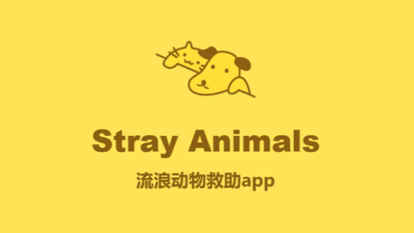

# StrayAnimals 🐾

[简体中文](README.cn.md)

<p align="center">
  
</p>

An Android application dedicated to stray animal rescue, adoption, and pet care education. This project aims to connect stray animals with potential adopters and provide a community for animal lovers.

## 📖 Introduction

"StrayAnimals" is a mobile platform designed to address the growing issue of stray animals. It allows users to publish information about stray animals they encounter, facilitating rescue and adoption. Additionally, the app offers a wealth of knowledge regarding pet care to help new owners.

## 📱 App Demo

<p align="center">
  
</p>

## ✨ Key Features

- **🏠 Adoption & Rescue Platform:**
  - Publish information about stray animals with photos and descriptions.
  - View stray animals available for adoption in a waterfall layout.
  - **GPS Location:** Automatically locate the position of the animal using Android LocationManager and Baidu Map API.

- **📚 Pet Encyclopedia:**
  - Access a library of pet care knowledge including articles, Q&A, and videos.
  - **Search:** Quickly find information with a search feature supporting history and animations.
  - **WebView Integration:** View detailed articles directly within the app.

- **👤 User System:**
  - **Login/Register:** Secure authentication using SQLite database.
  - **Preferences:** Set preferences during registration for personalized content.
  - **My Profile:** Manage your posts, collections, and view browsing history.

## 🛠️ Tech Stack

- **Language:** Java
- **Architecture:** MVVM (Login module), Fragment-based UI
- **Database:** SQLite
- **Network & Async:** AsyncTask, Jsoup (for data crawling)
- **UI Components:**
  - `RecyclerView` (Waterfall/Staggered Grid Layout)
  - `ViewPager` & `TabLayout`
  - `ConstraintLayout`
- **Third-Party Libraries:**
  - [Glide](https://github.com/bumptech/glide) - Image loading
  - [RoundedImageView](https://github.com/vinc3m1/RoundedImageView) - UI styling
  - [RecyclerView-animators](https://github.com/wasabeef/recyclerview-animators) - List animations
  - [Android-Debug-Database](https://github.com/amitshekhariitbhu/Android-Debug-Database) - Database debugging

## 🚀 Getting Started

1. **Clone the repository**
   ```bash
   git clone https://github.com/Largehare/stray-animals.git
   ```
2. **Open in Android Studio**
   - Select "Open an existing Android Studio project" and navigate to the cloned directory.
3. **Sync Gradle**
   - Allow Android Studio to download necessary dependencies.
4. **Run the App**
   - Connect an Android device or start an emulator.
   - Click the "Run" button.

---
*Developed for the "Mobile Application Development" course.*
